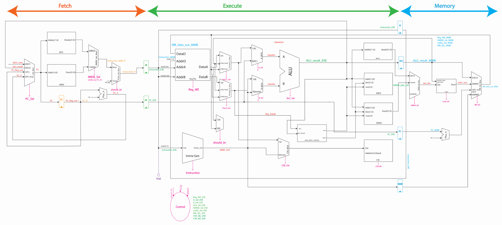

# RISC-V-Three-Stage-Pipeline

This is a RISC-V three stage pipeline (Instruction decode, execution and write back) design that features three memory interfaces (BIOS, data memory and instruction memory) and UART interface.

The processor supports all RV32I instruction.

A few CPI optimization will be done soon: branch prediction, add another set of pipeline register after Reg File.
