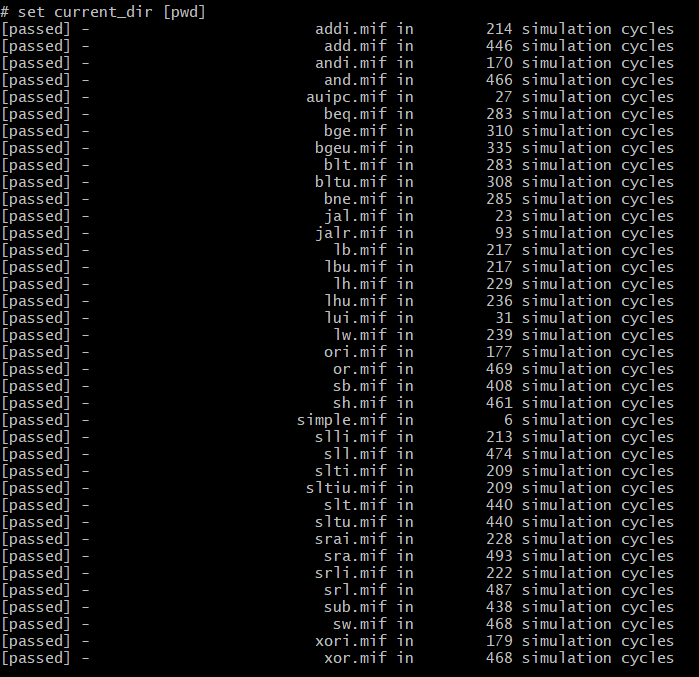

# RISC-V-Three-Stage-Pipeline

This is a RISC-V three stage pipeline (Instruction decode, execution and write back) design that features three memory interfaces (BIOS, data memory and instruction memory) and UART interface. 

The processor supports all RV32I instruction. It passed all the instruction test. Instruction tests are generated using this repo (https://github.com/riscv-software-src/riscv-tests/tree/5fe6092f9917d80f4d1bfd02ce36275a87c89910)

